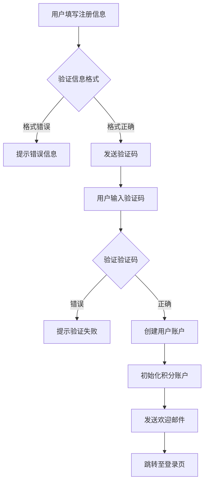
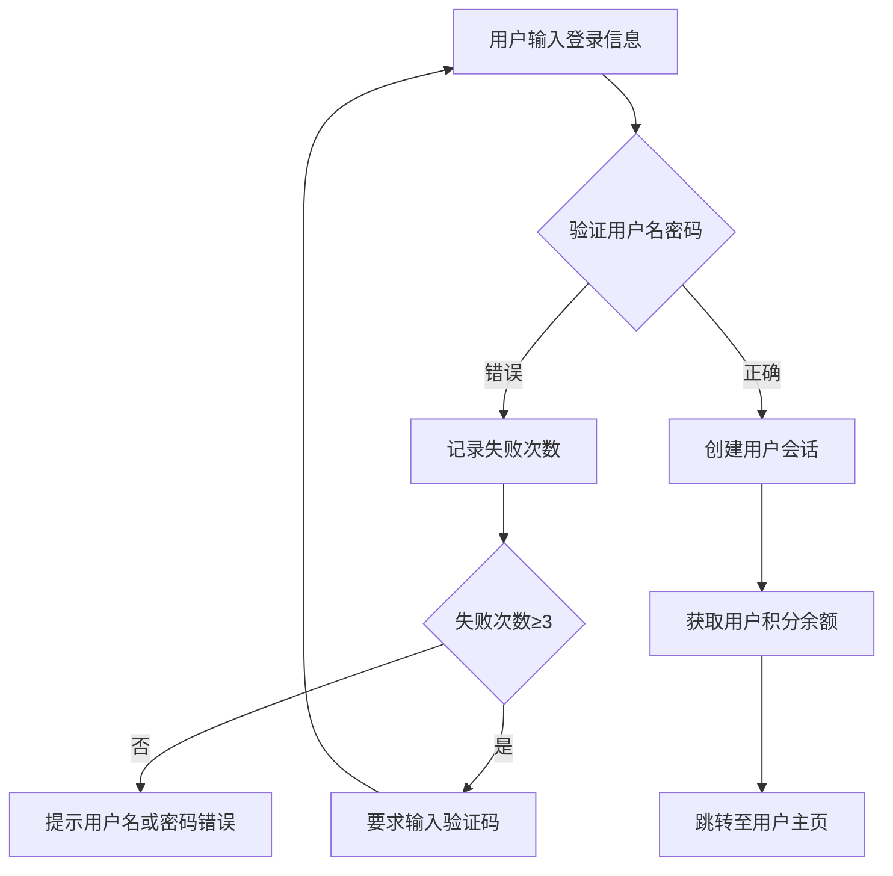
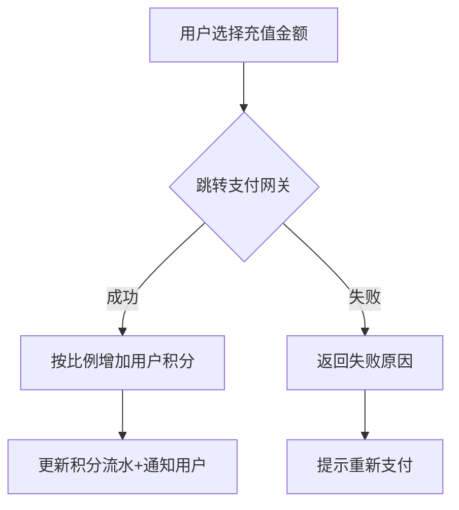
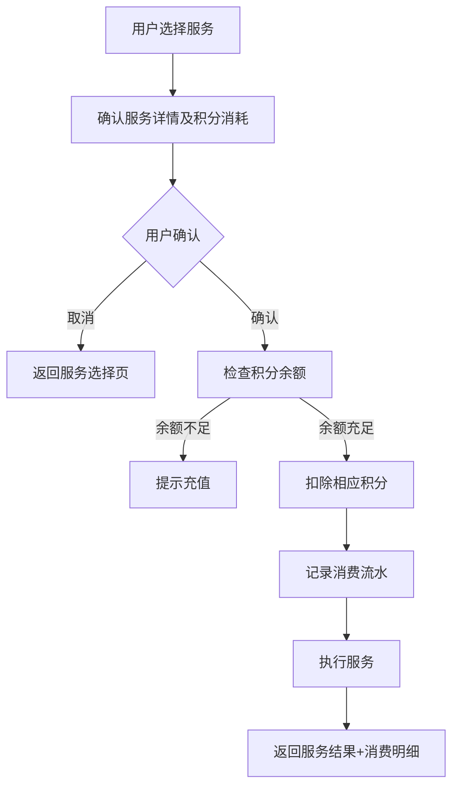

# SaaS用户管理系统精简需求文档

## 一、系统概述
本系统为SaaS应用【AI图片编辑】提供核心用户管理功能，整合用户账户、积分充值与服务消费扣费流程，旨在以最精简架构实现安全可靠的用户生命周期管理。
数据库使用sqlite。选择占用服务器资源最少得价格和开发语言。

## 二、核心功能模块

### 1. 用户账户管理
| 功能点       | 详细需求                                                                                               | 参考来源    |
|--------------|--------------------------------------------------------------------------------------------------------|-------------|
| **用户注册** | - 支持邮箱/手机号注册，验证信息后开通账户 - 必填字段：用户名、邮箱/手机、密码（加密存储） - 实现验证码机制确保注册安全 - 注册成功后自动创建积分账户 | [1](@ref)[3](@ref)[8](@ref) |
| **用户登录** | - 支持用户名/密码登录 - 实施登录失败锁定机制（如3次失败后需验证码） - 支持安全退出（Session清除） - 登录成功后返回用户基本信息和积分余额 | [3](@ref)[7](@ref)[8](@ref) |
| **密码管理** | - 强制强密码策略（长度≥8位，含大小写字母、数字、特殊字符） - 提供密码重置功能（通过邮箱验证） - 支持修改密码时验证原密码 | [7](@ref)[8](@ref)[9](@ref) |
| **安全防护** | - 密码加盐哈希加密（如BCrypt/SHA-256） - 防御SQL注入、XSS攻击 - 关键操作（如支付）需二次验证 - 实现CSRF防护机制 | [2](@ref)[5](@ref)[7](@ref) |

### 2. 积分账户管理
| 功能点           | 详细需求                                                                                              | 参考来源    |
|------------------|-------------------------------------------------------------------------------------------------------|-------------|
| **积分规则配置** | - 定义积分与人民币兑换比例（如1元=10积分） - 支持设置积分有效期（如1年自动清零） - 支持不同服务设置不同积分倍率 | [13](@ref)[16](@ref)  |
| **积分流水记录** | - 记录积分变动类型（充值、消费、奖励）、关联订单、变动前后余额 - 用户可查询积分明细 - 提供积分变动时间轴视图 | [14](@ref)[17](@ref)  |
| **积分状态通知** | - 积分变动后通过站内信或邮件通知用户 - 积分临近过期时提醒用户使用 - 支持用户自定义通知方式 | [15](@ref)[17](@ref)  |

### 3. 支付与积分兑换
| 功能点           | 详细需求                                                                                              | 参考来源    |
|------------------|-------------------------------------------------------------------------------------------------------|-------------|
| **支付渠道集成** | - 集成微信支付、支付宝API - 支付回调验证签名，确保数据安全 - 实现支付超时处理机制 | [12](@ref)[13](@ref)  |
| **充值流程**     | - 用户选择金额（如1/5/10元），跳转支付网关 - 支付成功后按比例自动充值积分到用户账户 - 支持充值优惠活动（如首充奖励） | [13](@ref)[14](@ref)  |
| **交易记录查询** | - 用户可查看充值记录（时间、金额、积分到账数量） - 支持按时间筛选和导出 - 提供交易状态实时更新 | [12](@ref)[13](@ref)  |

### 4. 服务消费与扣费
| 功能点           | 详细需求                                                                                              | 参考来源    |
|------------------|-------------------------------------------------------------------------------------------------------|-------------|
| **服务关联计费** | - 每项服务需预定义积分消耗规则（如"AI绘图1次=5积分"） - 支持按次、按时长、按用量等多种扣费模式 - 支持批量操作计费 | [17](@ref)       |
| **扣费流程**     | - 用户触发服务时，实时检查积分余额 - 余额充足则直接扣费并执行服务；不足则提示充值 - 扣费失败时提供明确错误信息 | [14](@ref)[17](@ref)  |
| **消费确认**     | - 扣费前需用户确认（尤其是高积分消耗操作） - 扣费后提供明细（如"AI绘图服务×2次，扣除10积分"） - 支持消费撤销机制（在服务未执行前） | [17](@ref)       |

## 三、关键业务流程

### 1. 用户注册流程

### 2. 用户登录流程

### 3. 积分充值流程

### 4. 服务消费扣费流程

